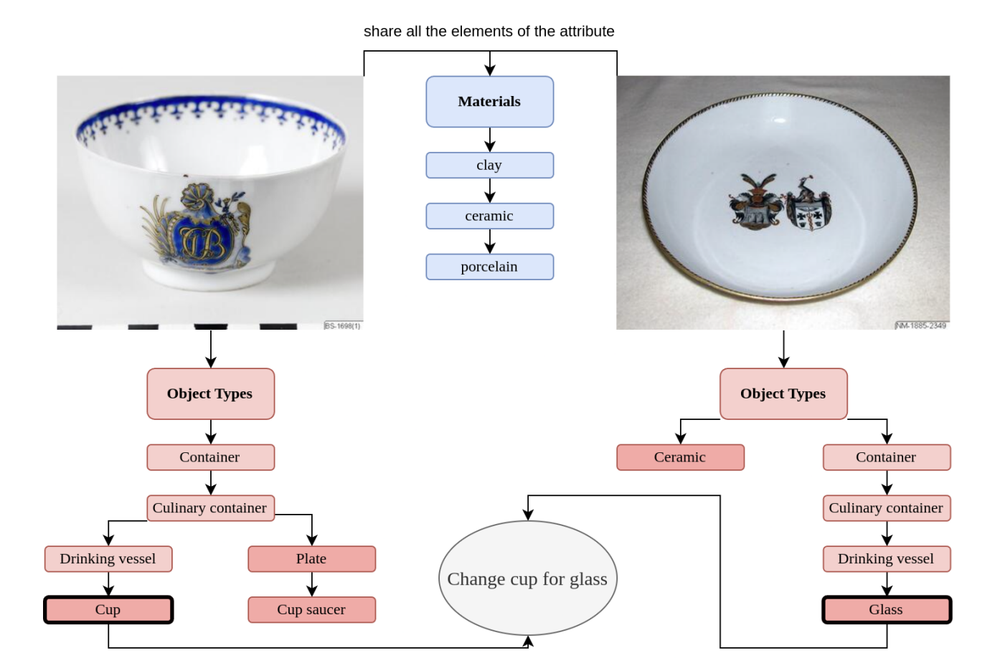

# 🎨 **EUFCC-CIR**: A Composed Image Retrieval Dataset for GLAM Collections

> **Authors**: *Francesc Net, Lluis Gomez*  
> **Institution**: *Computer Vision Center, Universitat Autònoma de Barcelona*

---

## 🏛️ Introduction

The **EUFCC-CIR** dataset is a cutting-edge resource designed to enable **Composed Image Retrieval (CIR)** within **Galleries, Libraries, Archives, and Museums (GLAM)** collections. It builds upon the **EUFCC-340K** image labeling dataset, providing over **180K meticulously annotated CIR triplets**. Each triplet comprises:

1. A **query image** 🖼️.
2. A **brief text description** 📝 that specifies a desired modification.
3. A **target image** 🎯 that fulfills the query.

This dataset is particularly beneficial for researchers in **digital humanities**, allowing them to retrieve and interact with **cultural heritage items** in new and engaging ways.

🔗 **Paper link**: [EUFCC-CIR Paper](http://arxiv.org/abs/2410.01536)  
📂 **Related dataset**: [EUFCC-340K](https://github.com/cesc47/EUFCC-340K/tree/main)

---

## 📁 Dataset Structure

The dataset is organized within the `data/` folder, consisting of the following key files:

- **`db_processed.txt`**: 📄 A list of images, each assigned to a partition (train, validation, test).
- **`cir_db.csv`**: 🗃️ Contains detailed information about image-text pairs and their corresponding target images.

### 🗂️ **CSV Columns Breakdown**

| 🔢 **Column**         | 📖 **Description**                                                                                   |
|-----------------------|------------------------------------------------------------------------------------------------------|
| **id1**               | 🆔 Identifier for the first image in the pair.                                                       |
| **id2**               | 🆔 Identifier for the second image in the pair.                                                      |
| **materials_1**       | 🏗️ Materials in the first image. Specifies the substances or materials used in the first object.    |
| **ObjectTypes_1**     | 🏷️ Object types in the first image. Defines the category or type of object represented.             |
| **materials_2**       | 🏗️ Materials in the second image. Specifies the substances or materials used in the second object.  |
| **ObjectTypes_2**     | 🏷️ Object types in the second image. Defines the category or type of object represented.            |
| **element_to_change** | 🔄 The element (materials or object type) that must change between the two images.                   |
| **element_changed**   | 🔄 The element (materials or object type) that was changed between the two images.                   |
| **partition**         | 📊 Denotes the dataset split (train, validation, test) that this row belongs to.                     |
| **query**             | 🔍 Describes the retrieval task, indicating how the transformation from `id1` to `id2` should occur. |

> **Note**: Each row in the CSV represents a relationship between two images (`id1` and `id2`), where an element in the first image is altered to generate the second image.

### 🌟 Example

Below is an example visualization of how an image transformation is represented in this dataset:

<div align="center">
    
</div>

---

## ⚙️ Installation & Usage

To get started, clone the repository and download the necessary files from the **EUFCC-340K** dataset:

```bash
git clone https://github.com/your-username/EUFCC-CIR.git 
cd EUFCC-CIR/data
# Download dataset files (from EUFCC-340K repo => link in the beginning)
